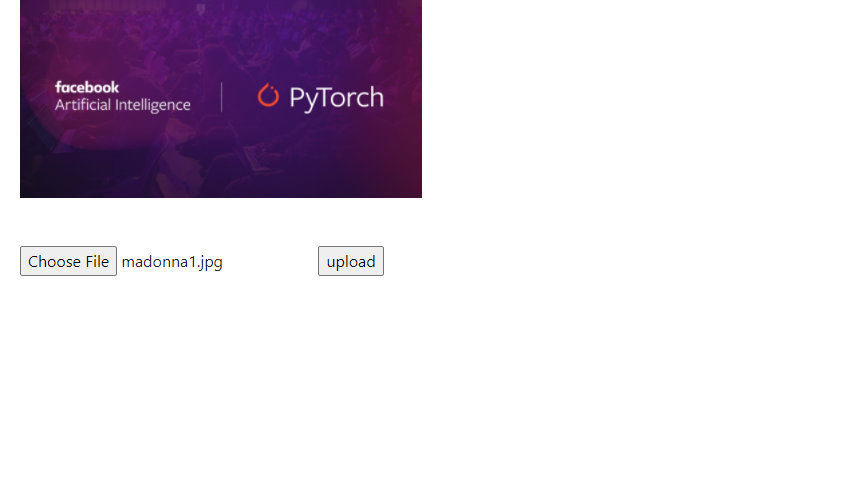
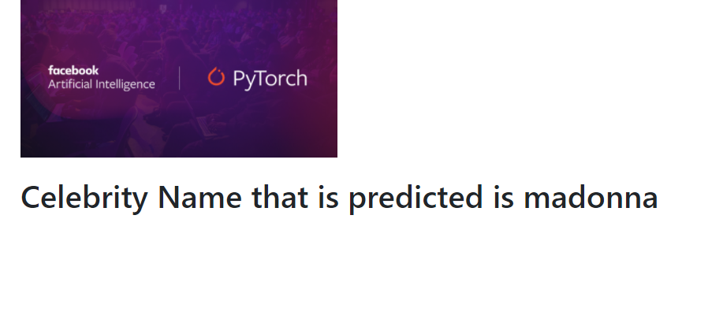

# Celeberity-Detector
In this project I have used Pytorch an open source machine learning library to create a CNN Model which uses Densenet for transfer learning it works to implement few shot learning(learnig from small dataset) to detect the faces of 5 celebraties Ben afflek, Elton john, Jerry seinfeld, Madonna and Mindy Kaling. To give it a user friendly interface I have used flask to create a web application, in the web application the user will upload a image and then the CNN network will predict the image and display the name of the celebrity it thinks is the most likely.

It is deployed using heroku 

Web Application is on this link: https://workingwithpytorch.herokuapp.com/ 

#Further work

1. Add more number of celebrities.
2. Increase the acuuracy from current 80% to above 90% while further decreasing the number of Images it train on
3. Make the Interface more User friendly

